# mneme -- Architecture & Design Documentation

Living documentation of mneme's architecture. Explains what was built, how it works, why each decision was made, and how the pieces fit together.

---

## Table of Contents

1. [What is mneme](#what-is-mneme)
2. [High-Level Architecture](#high-level-architecture)
3. [The Four Layers](#the-four-layers)
   - [Layer 1 -- Storage](#layer-1--storage)
   - [Layer 2 -- Graph](#layer-2--graph)
   - [Layer 3 -- Retrieval](#layer-3--retrieval)
   - [Layer 4 -- Synthesis](#layer-4--synthesis)
4. [Vault & Memory Manifest](#vault--memory-manifest)
5. [The Three Frontends](#the-three-frontends)
6. [End-to-End Flow Diagrams](#end-to-end-flow-diagrams)
7. [Consolidation Pipeline](#consolidation-pipeline)
8. [Rules System](#rules-system)
9. [Design Decisions](#design-decisions)
10. [Why These Choices](#why-these-choices)
11. [Performance Budgets](#performance-budgets)

---

## What is mneme

mneme is a persistent memory system for AI coding agents. A single Go binary (no runtime dependencies beyond libc for SQLite) that exposes an MCP server (Model Context Protocol) over stdio, letting any MCP-compatible agent -- Claude Code, OpenCode, Gemini CLI, Codex, Cursor, Windsurf -- save and retrieve structured knowledge between sessions.

### The problem

1. **CLAUDE.md as a battleground** -- Instruction files mix agent configuration with project knowledge. Team leader rules and developer preferences collide.
2. **Amnesia between sessions** -- Every new session starts from zero. Patterns discovered, architecture decisions, bugs resolved -- all lost.
3. **Knowledge silos** -- What is learned in one project does not exist in another. Reusable solutions, personal patterns, custom libraries -- none are shared.

### The solution

A local SQLite database with FTS5 full-text search, a weighted knowledge graph with Hebbian learning and Personalized PageRank, community detection via Louvain, and automatic synthesis -- all exposed through 57 MCP tools. Agents call `mem_save`, `mem_search`, `mem_context`, `mem_explore`, and `mem_gaps` to manage structured knowledge. Rules are injected automatically and enforced via hooks.

---

## High-Level Architecture

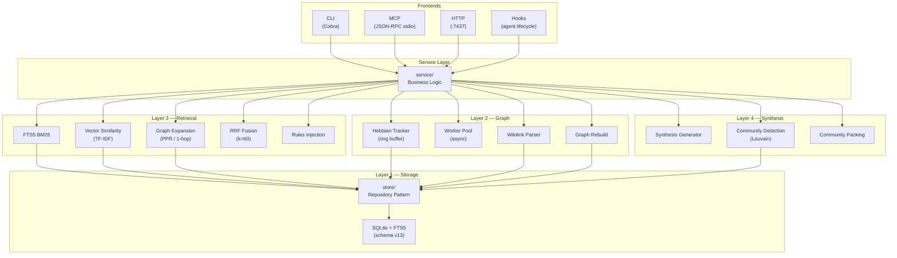

### Dependency rule -- Clean Architecture

Imports flow inward only. The `model` package is the leaf -- zero external dependencies. Frontends never call `store` or `db` directly; everything goes through `service`.

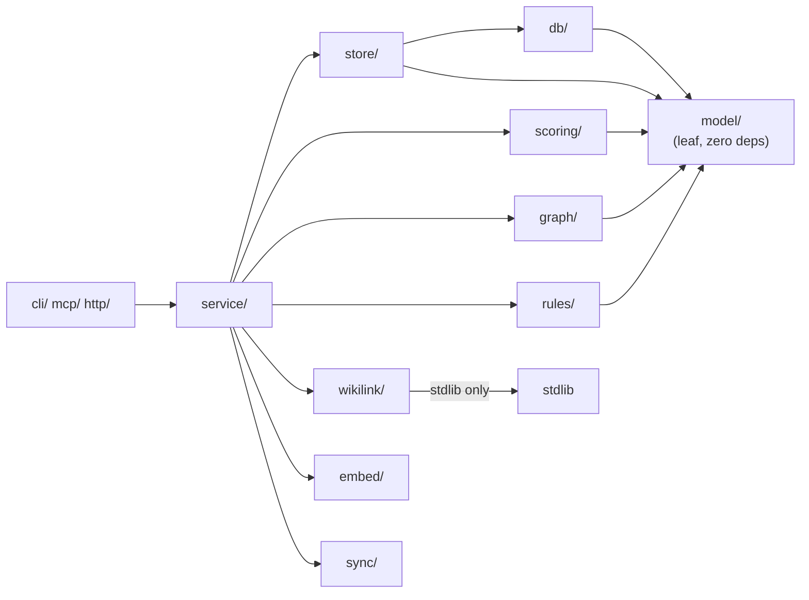

No internal package imports another that is "above" it in the dependency chain.

### Implemented packages (`internal/`)

```
cmd/mneme/              -- entrypoint (main)
internal/
  model/                -- domain types (11 memory types, 3 scopes, 7 entity kinds,
                           8 relation types, request/response structs). Zero deps.
  project/              -- git remote / project slug detection
  config/               -- TOML config + defaults + env overrides
  db/                   -- SQLite + FTS5 + embedded migrations (schema v13)
  store/                -- repository pattern (CRUD, FTS5, vectors, entities, relations,
                           communities, sessions, unresolved refs)
  scoring/              -- importance, decay (Ebbinghaus), BM25 re-rank, RRF fusion,
                           PPR (Personalized PageRank), SparseGraph, Louvain
  graph/                -- Hebbian subsystem (AccessTracker, HebbianWorkerPool),
                           Louvain community detection
  rules/                -- pattern matching engine (globs, tool selectors, negations)
  wikilink/             -- [[topic_key]] parser (CommonMark-aware, code-block safe)
  service/              -- business logic orchestration (the only layer frontends call)
  consolidation/        -- background pipeline: sweep, decay, dedup, budget, edge decay,
                           community detection, synthesis generation
  embed/                -- TF-IDF baseline embedder
  sync/                 -- JSONL.gz + Memory Manifest (tar.gz) export/import
  vault/                -- markdown vault: path mapping, frontmatter, writer, reader
  mcp/                  -- MCP server (JSON-RPC 2.0 over stdio, 57 tools)
  http/                 -- REST API (stdlib net/http, 10 endpoints under /v1/)
  cli/                  -- Cobra commands (35 top-level commands)
  install/              -- agent profile installer (7 subagent profiles + slash commands)
  tui/                  -- Bubble Tea interface (list, stats)
  upgrade/              -- self-upgrade checker
  export/               -- markdown export (rendering only, no filesystem)
docs/                   -- ARCHITECTURE.md, HOOKS.md, VAULT.md, MEMORY-MANIFEST.md, etc.
```

---

## The Four Layers

mneme's architecture is organized into four functional layers that build upon each other. Each layer adds capabilities while respecting the dependency rule.

### Layer 1 -- Storage

The persistence foundation. SQLite with WAL mode, foreign keys, 5s busy timeout. Two databases per host:

| Database | Location | Scope |
|----------|----------|-------|
| Global | `~/.mneme/global.db` | `global` + `org` memories |
| Project | `~/.mneme/projects/<slug>.db` | `project`-scoped memories |

**Scopes never leak between projects.** The service layer routes reads/writes via `storeFor(scope)`.

#### Schema v13 (migrations 001-013)

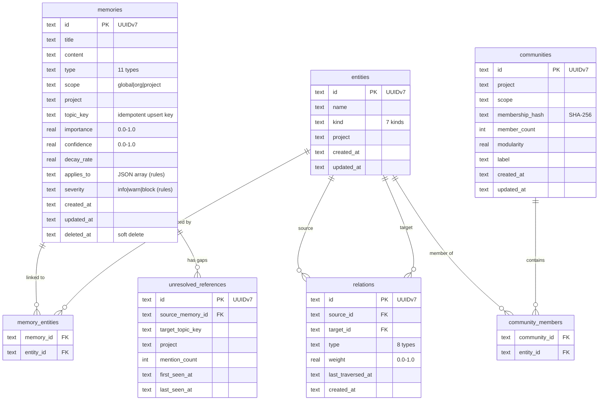

**Migration history:**

| # | Name | EPIC/SPEC | What it does |
|---|------|-----------|-------------|
| 001 | `initial` | -- | Core tables: memories, FTS5 index, sessions, schema_version |
| 002 | `knowledge_graph` | -- | entities, relations, memory_entities |
| 003 | `embeddings` | -- | embeddings table for vector search |
| 004 | `sdd` | -- | backlog_items, specs, spec_history, spec_pushbacks |
| 005 | `spec_pk_by_project` | -- | Composite spec PK (project, id) |
| 006 | `rule_fields` | SPEC-001 | `applies_to` + `severity` columns, partial index on type='rule' |
| 007 | `weighted_relations` | SPEC-005 | Backfill type-based weights, `last_traversed_at`, weight/traversal indices |
| 008 | `graph_expansion` | SPEC-007 | Index on `memory_entities(entity_id)` for O(log n) entity lookups |
| 009 | `unresolved_references` | SPEC-012 | `unresolved_references` table for wikilink gaps + auto-resolve |
| 010 | `communities` | SPEC-020 | `communities` + `community_members` tables for Louvain persistence |
| 011 | `add_lane` | SPEC-035 | `lane` + `scope` columns on `backlog_items` and `specs` for graduated (trivial/standard) lanes |
| 012 | `add_spec_base_sha_and_audits` | SPEC-036 | `base_sha` column on `specs`; `lane_audits` table for structured post-implementation audit records |
| 013 | `memory_relations` | SPEC-039 | `memory_relations` table for `conflicts_with`/`unrelated` memory-to-memory edges (`supersedes` reuses `memories.superseded_by`) |

#### Memory types (11)

| Type | Decay rate | Purpose |
|------|-----------|---------|
| `decision` | 0.005 | Architectural or technical decisions |
| `discovery` | 0.02 | Learned facts about a codebase, API, or tool |
| `bugfix` | 0.02 | Bug and its fix |
| `pattern` | 0.01 | Recurring design/implementation pattern |
| `preference` | 0.005 | Personal or team style preferences |
| `convention` | 0.005 | Naming, formatting, structural conventions |
| `architecture` | 0.005 | High-level structure and component relationships |
| `config` | 0.01 | Configuration values, endpoints, env settings |
| `session_summary` | 0.05 | Synthetic session-end summary (fast decay) |
| `rule` | **0.0** | Binding constraint with `applies_to` + `severity` (SPEC-001) |
| `synthesis` | **0.0** | Auto-generated community summary (SPEC-021) |

#### Entity kinds (7) and relation types (8)

**Entity kinds:** `module`, `service`, `library`, `concept`, `person`, `pattern`, `file`

**Relation types with default weights (SPEC-005):**

| Type | Default weight | Semantics |
|------|---------------|-----------|
| `depends_on` | 0.9 | A depends on B |
| `part_of` | 0.85 | A is a component of B |
| `implements` | 0.8 | A implements B |
| `uses` | 0.7 | A uses/calls B |
| `conflicts_with` | 0.7 | A conflicts with B |
| `supersedes` | 0.6 | A replaces B |
| `related_to` | 0.5 | Generic bidirectional (co-occurrence) |
| `references` | 0.4 | A references B (wikilinks) |

Weight range: `[0.0, 1.0]`. Explicit weights can be passed via `mem_relate`.

---

### Layer 2 -- Graph

The knowledge graph connects entities (nodes) via weighted directed relations (edges). Three mechanisms build and maintain it:

#### 2a. Hebbian auto-strengthening (SPEC-006)

"Cells that fire together, wire together." When an agent accesses memory A then memory B in the same session window, relations between their entities are strengthened automatically.

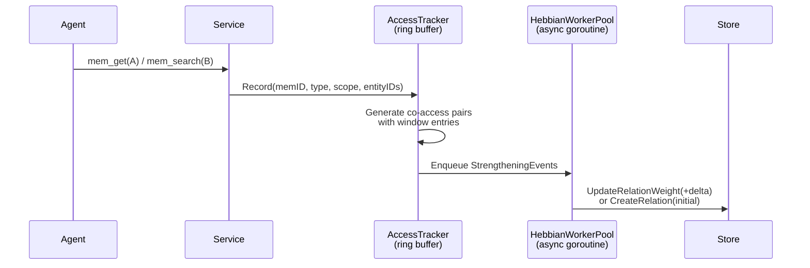

**Configuration (`config.toml [graph]`):**

| Parameter | Default | Function |
|-----------|---------|----------|
| `hebbian_window` | 5 | Ring buffer size (recent memory slots) |
| `hebbian_increment` | 0.05 | Delta applied to existing relations |
| `hebbian_initial_weight` | 0.1 | Weight for new Hebbian-created relations |
| `hebbian_buffer_size` | 1000 | Async channel capacity; events dropped when full |

**Safety guards:**
- D1: Cross-scope pairs (project vs global) are discarded
- D4: Self-loop guard -- consecutive access to the same memory ID produces nothing
- D5: Types `rule`, `session_summary`, and `synthesis` are excluded (noise generators)

#### 2b. Wikilink parser (SPEC-011)

`[[topic_key]]` references in memory content are automatically parsed on `mem_save` and `mem_update`. The parser (`internal/wikilink/`) is CommonMark-aware: it skips fenced code blocks (``` and ~~~) and inline code spans.

Supported forms: `[[topic]]`, `[[topic#anchor]]`, `[[topic|alias]]`, `[[topic#anchor|alias]]`.

**Resolution flow:**
1. Parse wikilinks from content
2. For each `[[topic_key]]`: look up a memory with that `topic_key`
3. **Found** -- create a `references` relation (weight from `wikilink_relation_weight`, default 0.6)
4. **Not found** -- insert into `unresolved_references` table (SPEC-012). Auto-resolved when a memory with that `topic_key` is later saved.

Unresolved references power the `mem_gaps` tool (SPEC-013), which surfaces knowledge debt.

#### 2c. Graph rebuild (SPEC-009)

`mneme graph rebuild` bootstraps the graph for projects with pre-existing memories that have no graph data. Four extraction heuristics:

| Heuristic | What it detects | Example |
|-----------|----------------|---------|
| H1: topic_key | Each topic_key becomes a `concept` entity | `architecture/auth-model` |
| H2: file paths | Recognized paths in content become `file` entities | `internal/store/entity.go` |
| H3: code symbols | `func`/`type`/`struct` in code blocks | `func NewMemoryStore` |
| H4: wikilinks | `[[topic_key]]` references | `[[architecture/auth-model]]` |

**Co-mention:** Memories sharing >= K entities (default K=2) receive a `related_to` relation with `weight = min(0.5, shared_count * 0.1)`.

**Idempotent:** Safe to re-run. `--force` only deletes `related_to` relations before regenerating; explicit types (`depends_on`, `implements`, etc.) are never touched.

#### 2d. Edge decay (SPEC-006)

Relations not traversed decay during consolidation:

```
if days_since_last_traversed > edge_decay_after_days:
    weight *= exp(-edge_decay_rate * excess_days)
```

| Parameter | Default |
|-----------|---------|
| `edge_decay_rate` | 0.02/day |
| `edge_decay_after_days` | 30 |

Relations with `last_traversed_at = NULL` (never traversed since migration 007) are excluded from decay to avoid penalizing historical edges.

---

### Layer 3 -- Retrieval

#### 3-channel RRF fusion (SPEC-007, SPEC-015, SPEC-017)

`mem_search` fuses three independent retrieval channels via Reciprocal Rank Fusion:

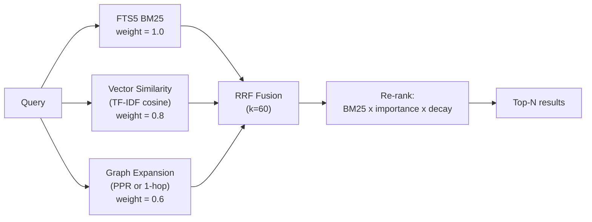

**RRF formula:**

```
RRF_score(d) = SUM over all rank lists R:
    weight_R / (k + rank_R(d))

k = 60 (standard RRF constant)
```

Channel weights reflect reliability: FTS5 (1.0) is the most precise signal (exact term matches), vector (0.8) captures semantic similarity, and graph (0.6) adds topological context but is noisier.

#### Graph expansion modes (`config.toml graph_mode`)

| Mode | Algorithm | When to use |
|------|-----------|-------------|
| `ppr` (default) | Personalized PageRank via `BuildGraphForSeeds` + `scoring.PPR` (SPEC-015/017) | Multi-hop, considers global topology. Best for dense graphs. |
| `1hop` | 1-hop bidirectional expansion via `graphExpand` (SPEC-007) | Faster, simpler. Useful for sparse graphs or debugging. |
| `off` | No graph channel; 2-channel RRF (FTS5 + vector) | Fallback when graph adds no value. |

`ExpansionEnabled=false` is the absolute kill switch. `include_graph=false` in individual requests overrides `graph_mode`.

**PPR parameters (SPEC-015):**

| Parameter | Default | Source |
|-----------|---------|--------|
| Alpha (teleport probability) | 0.85 | Brin & Page 1998 |
| MaxIter | 100 | Convergence threshold |
| Epsilon (L1 convergence) | 1e-6 | Standard for <50K nodes |
| MaxDepth (BFS for graph build) | 3 | PPR mass at d=3 is negligible |
| MaxNodes (graph build cap) | 5000 | <20ms at this scale |
| WeightThreshold | 0.3 | 4+ Hebbian co-accesses required |
| FanOutCap | 50 | Prevents hub-node explosion |

**1-hop expansion parameters (SPEC-007):**

| Parameter | Default |
|-----------|---------|
| `expansion_threshold` | 0.3 |
| `expansion_fan_out_cap` | 50 |
| `expansion_seed_top_k` | 10 |

**Hebbian tracking post-search:** Top-3 results from each search are registered for Hebbian auto-strengthening, reinforcing relations between frequently co-retrieved memories.

#### `mem_explore`: Prioritized BFS (SPEC-008)

`mem_explore` performs a prioritized BFS (max-heap by `accumulatedWeight` descending) from a seed memory.

**Seed resolution:** Full UUID, hex prefix (8+ chars), or `topic_key`.

**Algorithm:**
1. Resolve seed -> get entities -> enqueue neighbors at distance 1
2. BFS loop: pop from max-heap, check token budget, expand neighbors if depth remains
3. `accumulatedWeight = parent_weight * relation_weight` (product along the path)
4. Results ordered by `(distance ASC, accumulated_weight DESC)`
5. Traversed relations are touched asynchronously via `BatchTouchRelations`

**Parameters:** `depth` (0-5, default 2), `budget` (tokens, default 4000), `threshold` (min weight, default 0.3).

#### Rules injection in `mem_context` (SPEC-002)

`mem_context` injects all active rules with a **dedicated token budget** (default 1500 tokens), separate from the general memory budget. Rules always appear in the context regardless of how many other memories compete:

```
<!-- mneme:context:start -->
# mneme -- Session Context

## Active Rules (N rules, ~M tokens)
### [BLOCK] No vendor edits
Never edit vendor/ files.
_Applies to: vendor/**_
---

## Loaded Memories (X of Y)
...
<!-- mneme:context:end -->
```

Rules are sorted by severity DESC -> effective importance DESC -> updated_at DESC, ensuring `block` rules always appear first.

---

### Layer 4 -- Synthesis

The synthesis layer builds on communities and graph data to generate higher-level knowledge artifacts.

#### 4a. Community detection -- Louvain (SPEC-019/020)

The Louvain algorithm (Blondel et al. 2008) detects communities of densely connected entities in the knowledge graph. It runs during each consolidation cycle.

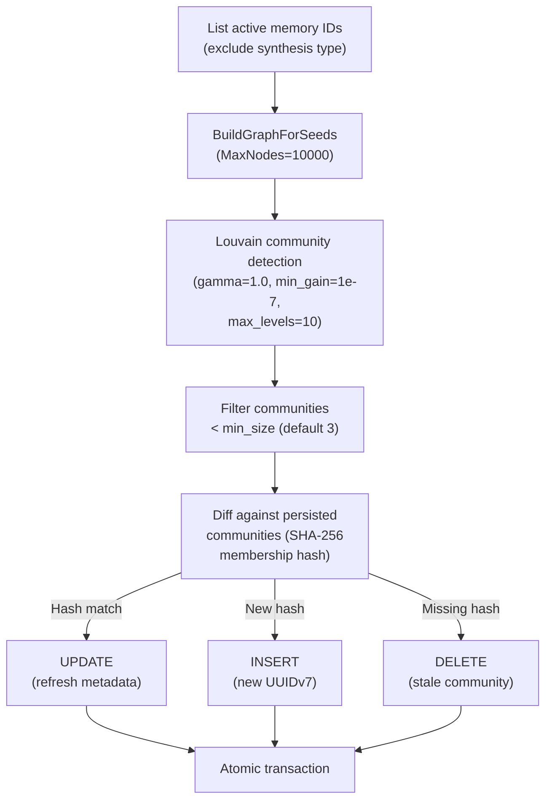

**Configuration:**

| Parameter | Default |
|-----------|---------|
| `community_detection_enabled` | true |
| `community_min_size` | 3 |

#### 4b. Synthesis generation (SPEC-021)

After community detection, a deterministic generator produces `synthesis` type memories -- one per community. No LLM required.

**Content structure:** Overview line, top-3 members (detailed), all members table (capped at `synthesis_max_members=50`), aggregate metadata. Wikilinks `[[topic_key]]` link synthesis to members.

**Lifecycle:**
- New community -> create synthesis (topic_key: `synthesis/community-{uuid7}`)
- Stable community (same hash) -> check content; upsert if changed, skip if identical
- Deleted community -> soft-delete synthesis via `mem_forget`

**Exclusions:** Synthesis memories are excluded from:
- Community detection seeds (prevents synthesis-of-synthesis loops, D5)
- Hebbian co-access tracking (prevents graph inflation, D6)
- But **included** in wikilink processing (D8) -- `references` relations are the linking mechanism

**Configuration:**

| Parameter | Default |
|-----------|---------|
| `synthesis_enabled` | true |
| `synthesis_max_members` | 50 |
| `synthesis_top_n` | 3 |

#### 4c. Community packing in `mem_context` (SPEC-022)

When communities exist, `mem_context` uses a 4-phase community-aware packing algorithm instead of flat scoring:

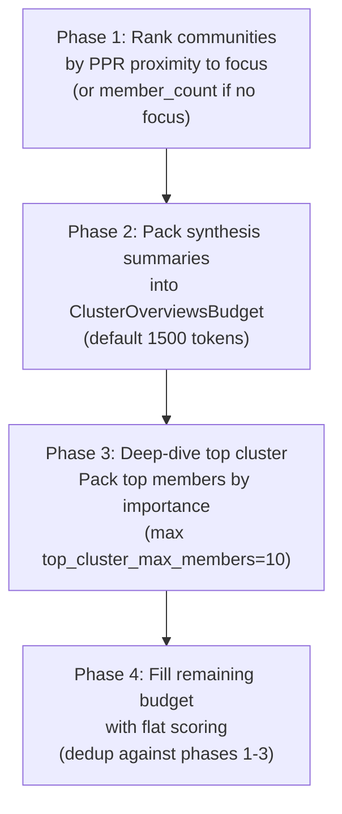

**Packing modes (`context_packing_mode`):**

| Mode | Behavior |
|------|----------|
| `auto` (default) | Community packing when communities exist; flat otherwise |
| `communities` | Always attempt community packing; falls back to flat silently |
| `flat` | Original flat scoring; ignores communities entirely |

---

## Vault & Memory Manifest

### Vault -- Markdown mirror (SPEC-023/024)

The vault is a filesystem mirror of the SQLite database in human-readable Markdown with YAML frontmatter. It enables:
- Browsing memories in Obsidian (zero integration needed)
- PR-reviewable memory changes
- Offline backup in a universal format

**Layout:**
```
~/.mneme/vaults/<slug>/
  .mneme-vault              # JSON marker (vault_version, project, scope)
  notes/
    architecture/
      auth-model.md         # topic_key segments = directory segments
    patterns/
      repository.md
    _no-topic/
      019abc12.md           # memories without topic_key (8-char UUID prefix)
```

**Frontmatter:** 17 fields max, fixed-order YAML (no `gopkg.in/yaml.v3` dependency). Always: id, type, scope, title, importance, confidence, decay_rate, created_at, updated_at, revision_count. Conditional: topic_key, project, created_by, files, applies_to, severity, superseded_by.

**Export:** Atomic writes (tmp file + `os.Rename`). Idempotency via `updated_at` comparison (first 512 bytes probe). Soft-deleted memories never exported.

**Import:** Two strategies -- `merge` (default, file wins when `updated_at > DB`) and `overwrite` (file always wins). Marker file mandatory (prevents cross-project injection). Per-memory `service.Save()`/`Update()` calls (crash-safe, re-runnable).

### Memory Manifest -- Open spec (SPEC-026)

A portable archive format for cross-tool memory interchange. Modeled after Obsidian's JSON Canvas -- a neutral, open specification.

**Format:** `manifest.tar.gz` containing `manifest.json` + `schemas/` directory. JSON Schema 2020-12.

**Contents:**
- All 22 Memory fields
- All 7 Entity fields
- All 9 Relation fields
- All 6 Session fields
- Producer metadata + stats

**Excluded from v1.0:** Embeddings (large, model-specific, regenerable), unresolved references (derived), communities (derived), SDD state (workflow semantics).

**Import auto-detection:** Extension-based (`.manifest.tar.gz`) + content inspection (POSIX tar magic at byte 257). Entity ID remapping on import (CreateEntity generates new UUIDv7, relations are translated via `map[srcID]dstID`).

**CLI:**
```bash
mneme sync export --format manifest -o backup.manifest.tar.gz
mneme sync import backup.manifest.tar.gz   # auto-detects format
```

---

## The Three Frontends

### MCP (primary) -- `mneme mcp`

JSON-RPC 2.0 over stdio. ProtocolVersion `2024-11-05`. 57 tools with JSON schemas, grouped by family:

| Group | Count |
|-------|-------|
| **Memory** (`mem_*`) | 14 |
| **Backlog** (`backlog_*`) | 4 |
| **Spec** (`spec_*`, incl. `spec_quick`/`spec_reject`) | 8 |
| **Lane** (`lane_*`) | 5 |
| **CodeGraph** (`codegraph_*`) | 10 |
| **Skills** (`skills_*`) | 7 |
| **Model** (`model_*`) | 3 |
| **Conflicts** (`conflicts_*`) | 5 |
| **init** | 1 |

Full per-tool contracts (params, returns, errors, examples) live in [docs/api/](api/), one file per family.

`handleMessage()` is exposed separately from `Run()` for unit testing without I/O loops (D007).

### HTTP API -- `mneme serve --addr :7437`

Stdlib `net/http`, graceful shutdown 10s. 10 route registrations under `/v1/`
(`internal/http/server.go:90-116`); one of them (`/v1/memories/{id}`) also
serves the `/explore` suffix, so it handles four distinct request shapes:

| Route registration | Methods handled | Status |
|---------------------|------------------|--------|
| `/v1/health` | GET | 200 |
| `/v1/memories` | POST | 201 |
| `/v1/memories/search` | GET | 200 |
| `/v1/memories/context` | GET | 200 |
| `/v1/memories/{id}` (+ `/explore` suffix) | GET, PATCH, DELETE, GET `.../explore` | 200 |
| `/v1/sessions/end` | POST | 200 |
| `/v1/entities/relate` | POST | 201/200 |
| `/v1/stats` | GET | 200 |
| `/v1/gaps` | GET | 200 |
| `/v1/consolidate` | POST | 200 |

Full contract for every route: [docs/api/http.md](api/http.md).

**HTTP gap:** no SDD/lane/codegraph/skills/model/conflicts endpoints at all,
and no `mem_checkpoint`, `mem_timeline`, or `mem_suggest_topic_key`. (`mem_gaps`
and `mem_explore` **are** exposed -- via `/v1/gaps` and the `/explore` suffix
above, respectively; they are not part of the gap.) No auth, no rate limiting.

### CLI -- Cobra

35 top-level commands: `save`, `search`, `get`, `update`, `forget`, `status`, `stats`, `consolidate`, `serve`, `mcp`, `init`, `install`, `upgrade`, `version`, `completion`, `sync export|import|status`, `rule add|list|test`, `explore`, `graph rebuild|cleanup-orphan-relations`, `gaps`, `vault export|import`, `embed backfill`, `export markdown`, `config show`, `hook`, `tui`, `backlog add|list|refine|promote|archive`, `spec new|advance|pushback|resolve|quick|reject|list|status|history`, `lane audit|reclassify|override|status|stats`, `codegraph index|search|node|callers|callees|impact|trace|files|status|hooks`, `skills list|install|pin|unpin|remove|lint|validate`, `model list|set|reset`, `conflicts candidates|scan|link|unlink|list`, `subagents fingerprint|profile|compose|write|manifest-list`, `delegation-hook enable|disable|status`. Full flag reference: [docs/api/cli.md](api/cli.md).

### Hooks (`internal/cli/hook.go`)

4 hook handlers invoked by the agent system:

| Hook | Type | Purpose |
|------|------|---------|
| `session-start` | Observational | Hydrates context with `mem_context` |
| `session-end` | Observational | Persists session summary |
| `pre-tool-use` | Enforcement | Matches rules against tool+path, blocks on severity=block |
| `enforce-delegation` | Enforcement | Blocks `Edit`/`Write`/`MultiEdit` on protected paths |

**`pre-tool-use` performance:** <50ms target. Single query with `LIMIT 200`, in-memory matching. **Fail open:** any internal error results in exit 0 (allow).

---

## End-to-End Flow Diagrams

### `mem_save`

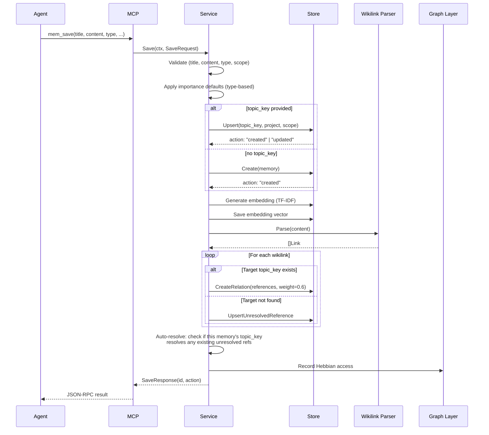

### `mem_search`

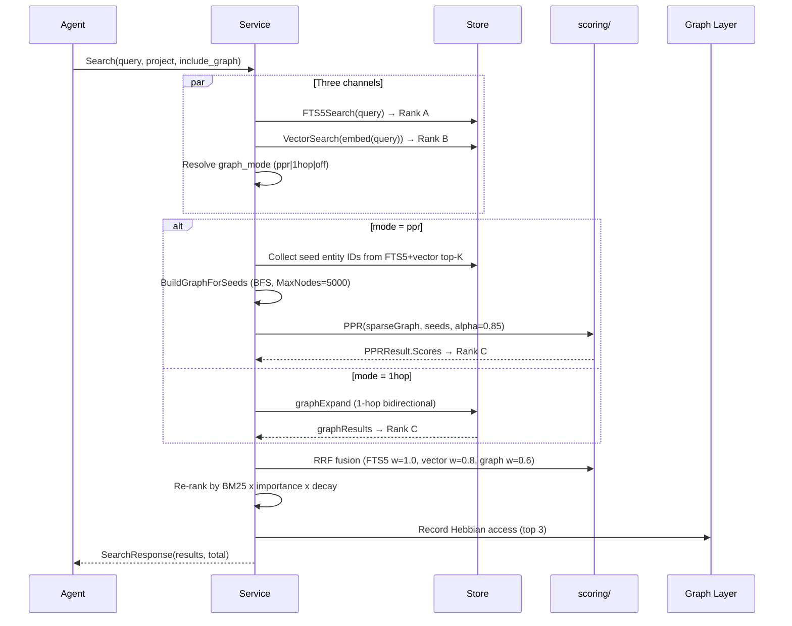

### `mem_context`

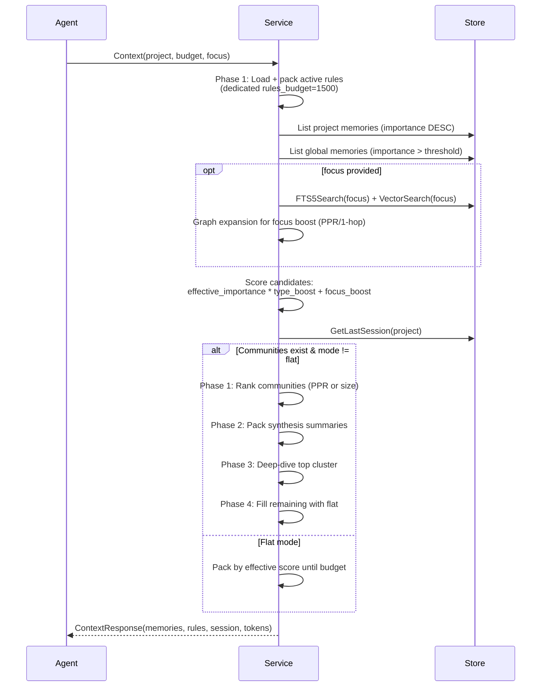

### Consolidation sweep

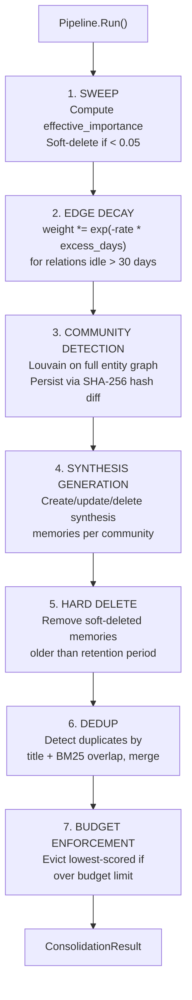

Runs automatically when `mneme mcp` starts and every 6h (configurable). Both project and global stores are processed.

---

## Rules System

### Model (SPEC-001)

Rules are memories of type `rule` with two additional fields:
- **`applies_to`**: JSON array of pattern strings
- **`severity`**: enforcement level (`info` / `warn` / `block`)

Rules are **immune to decay** (`decay_rate = 0`) -- they remain active until explicitly revoked via `mem_forget` or `mem_update` (D016).

### Pattern syntax

| Pattern | Matches |
|---------|---------|
| `**` | Any tool, any path (global wildcard) |
| `tool:Edit` | Specific tool name (case-sensitive) |
| `internal/**/*.go` | Path glob with doublestar |
| `tool:Edit+internal/**` | AND: both tool AND path must match |
| `!docs/**` | Negation: vetoes the rule when matched |
| `["**", "!docs/**"]` | Combined: everything except docs/ |

### Hook enforcement (SPEC-003)

The `mneme hook pre-tool-use` hook runs before `Edit`, `Write`, and `MultiEdit`:

1. Read JSON from stdin (tool_name + tool_input.file_path)
2. Open DBs in read-only mode (no migrations, no WAL writer)
3. Match rules against tool + path
4. Emit markdown to stdout with applicable rules
5. Exit 2 if any rule has severity `block`

**Performance:** <50ms. Single query with `LIMIT 200`, in-memory matching.
**Fail open:** Any internal error results in exit 0 (allow) (D017).

### CLI (SPEC-004)

```bash
# Create rule
mneme rule add --title "No vendor edits" --content "..." \
  --applies-to "vendor/**" --severity block

# List rules (colored by severity)
mneme rule list
mneme rule list --severity block --scope global

# Test against simulated invocation
mneme rule test --tool Edit --path internal/store/memory.go
```

---

## Design Decisions

### Storage decisions

| ID | Decision | Rationale | SPEC |
|----|----------|-----------|------|
| D001 | SQLite with CGO (`mattn/go-sqlite3`) | FTS5 is critical; no pure-Go driver supports it | -- |
| D002 | UUIDv7 for all IDs | Time-sortable, globally unique without coordination (RFC 9562) | -- |
| D003 | No ORM -- raw SQL with `database/sql` | Full control, no abstraction leaks | -- |
| D004 | Tests against real SQLite in-memory | DB is part of the unit under test; no mocks | -- |
| D005 | `model/` has zero external deps | Leaf package, clean architecture boundary | -- |
| D006 | Build tag `-tags fts5` mandatory | Prevents accidental builds without FTS5 | -- |
| D009 | `SetMaxOpenConns(1)` in tests | Prevents deadlock with `:memory:` databases | -- |
| D010 | Rows closed before secondary queries | Avoids SQLite lock contention in shared-cache mode | -- |

### Graph decisions

| ID | Decision | Rationale | SPEC |
|----|----------|-----------|------|
| D011 | Type-differentiated relation weights [0.0, 1.0] | `depends_on=0.9` is structural; `references=0.4` is weak signal | SPEC-005 |
| D012 | Single-worker Hebbian goroutine, buffered channel, drop policy | Simplicity over throughput; read path never blocks | SPEC-006 |
| D013 | Graph expansion as 3rd RRF channel (weight 0.6) | Topologically connected memories surface even without text match; low weight prevents graph dominance | SPEC-007 |
| D014 | BFS with product-of-weights accumulation | Product penalizes long weak paths: `0.3^3 = 0.027` vs `0.9^3 = 0.729` | SPEC-008 |
| D015 | Idempotent rebuild with 4 heuristics | Bootstraps graph for legacy projects; `--force` only touches `related_to` | SPEC-009 |

### Retrieval decisions

| ID | Decision | Rationale | SPEC |
|----|----------|-----------|------|
| D018 | PPR alpha=0.85 (Brin & Page 1998) | Standard value, balances topology vs seed affinity | SPEC-015 |
| D019 | Map-based adjacency (not CSR) | <50K nodes per project; simplicity > cache locality | SPEC-015 |
| D020 | MaxNodes=5000 for graph build | PPR benchmarks confirm <20ms at this scale | SPEC-016 |
| D021 | GraphMode config with per-request override | Allows experimentation without restarting | SPEC-017 |
| D022 | `mem_suggest_topic_key` via Jaccard + gap boost | Surfaces gap matches alongside existing keys | SPEC-014 |

### Community & synthesis decisions

| ID | Decision | Rationale | SPEC |
|----|----------|-----------|------|
| D023 | SHA-256 membership hash for community diff | Collision-resistant, stdlib, O(1) lookup | SPEC-020 |
| D024 | Deterministic synthesis (no LLM) | Reproducible, fast, zero external dependencies | SPEC-021 |
| D025 | Synthesis excluded from detection seeds + Hebbian | Prevents loops and graph inflation | SPEC-021 |
| D026 | 4-phase community packing (rank + overview + detail + fill) | Focus-aware context that leverages graph structure | SPEC-022 |

### Rules decisions

| ID | Decision | Rationale | SPEC |
|----|----------|-----------|------|
| D016 | Rules immune to decay (`decay_rate=0`) | Active constraints must not fade; revoke explicitly | SPEC-001 |
| D017 | Pre-tool-use hook fail open | Broken hook must never block the agent from working | SPEC-003 |

### Vault & manifest decisions

| ID | Decision | Rationale | SPEC |
|----|----------|-----------|------|
| D027 | New `vault/` package (not extend `export/`) | Single responsibility; export is rendering-only | SPEC-023 |
| D028 | Manual YAML serialization (no gopkg.in/yaml.v3) | Flat key-value frontmatter; `fmt.Fprintf` is deterministic | SPEC-023 |
| D029 | Atomic writes (tmp + os.Rename) | POSIX-safe on same filesystem | SPEC-023 |
| D030 | Manifest format: `manifest.tar.gz` with JSON Schema 2020-12 | Extensible, bundled schemas, offline validation | SPEC-026 |
| D031 | SDD types excluded from manifest | Workflow semantics don't transfer across installations | SPEC-026 |

### Frontend decisions

| ID | Decision | Rationale | SPEC |
|----|----------|-----------|------|
| D007 | `handleMessage()` exposed for MCP testing | Unit tests drive the MCP server without I/O loops | -- |
| D008 | Fire-and-forget access tracking in `service.Get()` | Access count increments after response returns | -- |

---

## Why These Choices

**Why SQLite, not Postgres/Redis?** Zero infrastructure. mneme is a single binary for individual developers. SQLite's FTS5 provides full-text search good enough for <100K memories. WAL mode handles the single-writer-many-reader pattern perfectly.

**Why FTS5 BM25, not just embeddings?** BM25 is exact-match and highly precise when it fires. TF-IDF embeddings are a semantic complement. The two channels cover different failure modes: BM25 misses paraphrases, embeddings miss exact terms. RRF fusion gives both a voice.

**Why Personalized PageRank?** Standard PageRank treats all nodes equally. PPR biases the random walk toward the query-relevant seed set, making it a natural fit for "find memories related to X." Multi-hop propagation surfaces connections that 1-hop expansion misses.

**Why Louvain, not spectral clustering / label propagation?** Louvain is the most widely used community detection algorithm (>40K citations). It is fast (O(n log n) in practice), deterministic with sorted input, and produces high-modularity partitions. Reference implementations exist in every language (NetworkX, igraph), making the algorithm well-understood and debuggable.

**Why Hebbian strengthening?** Co-accessed memories should become more strongly related over time. The biological metaphor (Hebb 1949) maps directly to the use case: if an agent repeatedly retrieves "auth model" and "JWT validation" in the same session window, the graph should reflect that association without explicit `mem_relate` calls.

**Why rules as first-class memories?** Rules need the same storage, search, and scope isolation as other memories. Making them a memory type with special fields (`applies_to`, `severity`) avoids a parallel system while enabling rule-specific behaviors (zero decay, dedicated context budget, hook enforcement).

**Why a vault (Markdown mirror)?** SQLite is opaque to humans. A Markdown mirror with frontmatter is browsable in any editor, reviewable in PRs, and opens the door to Obsidian as a zero-integration read-only frontend. The vault is a view, not the source of truth -- SQLite remains canonical.

**Why Memory Manifest (open spec)?** Avoids vendor lock-in. JSON Schema-based validation, tar.gz bundling for extensibility, and auto-detection on import make the format tool-agnostic. Other agents can read and write mneme memories without importing mneme's Go code.

---

## Performance Budgets

Verified against benchmarks in `internal/service/bench_test.go`.

| Operation | Target | Verified |
|-----------|--------|----------|
| `mem_search` (FTS5 only, 5K memories) | <50ms | `BenchmarkSearch_GraphExpansion_5K` |
| `mem_search` (graph expansion overhead vs no graph) | <50ms additional | SPEC-007 AC3 |
| `mem_context` (community packing, 5K memories) | <200ms | `BenchmarkContext_CommunityPacking` |
| Pre-tool-use hook (rule matching) | <50ms | Read-only DB, `LIMIT 200`, in-memory matching |
| PPR convergence (<50K nodes) | <20ms | `scoring.PPR` with MaxNodes=5000 |
| Louvain community detection | <500ms for typical project graphs | `DefaultLouvainOptions` (gamma=1.0, max_levels=10) |
| Vault export (5K memories) | <10s | Sequential writes, no parallelism in v1 |
| Vault import (1K files) | <10s | Sequential reads, no parallelism in v1 |

**Test suite:** 527+ test functions across core packages. Tests run against real in-memory SQLite (no mocks). Target >85% coverage on `model`, `store`, `service`, `scoring`.

---

*Last updated: 2026-04-30. Reflects the state of mneme after EPIC-1 through EPIC-6 (SPEC-001 through SPEC-026).*
